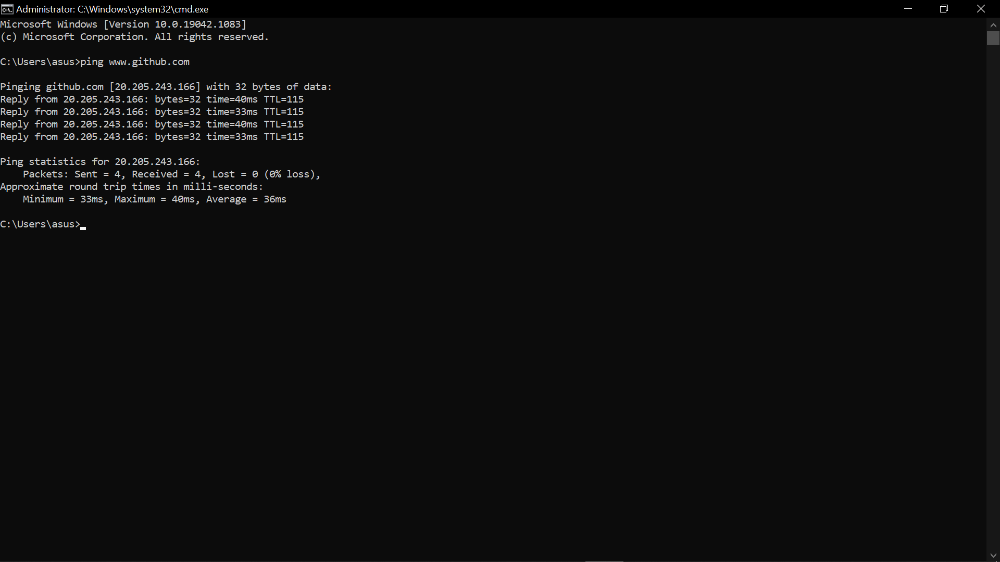
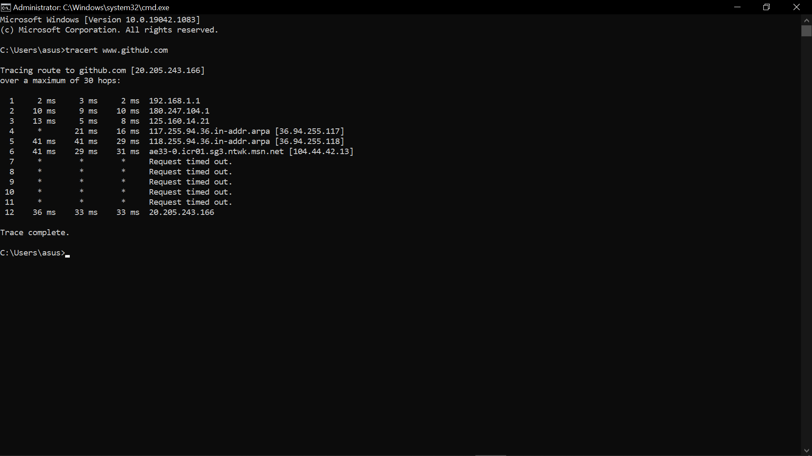

# KONSEP JARINGAN

## Ping & Traceroute

1. **Ping**, adalah utilitas sederhana yang digunakan untuk menguji koneksi ke host atau perangkat jaringan lainnya. Pengujian ini dilakukan dengan mengirimkan paket ICMP (Internet Control Message Protocol) ke tujuan yang ditentukan dan kemudian mengukur waktu yang diperlukan untuk menerima respons kembali. Ini membantu dalam mengukur latensi atau jeda waktu antara pengiriman dan penerimaan paket. Hasil ping juga sering menyertakan informasi tentang jumlah paket yang hilang atau waktu respons rata-rata.

2. **Traceroute**, adalah utilitas yang digunakan untuk melacak rute yang diambil oleh paket melalui jaringan dari satu titik ke tujuan lainnya. Utilitas ini bekerja dengan mengirimkan serangkaian paket dengan TTL (Time to Live) yang bertambah dari satu hingga nilai yang mencukupi untuk mencapai tujuan. Setiap perangkat jaringan yang menerima paket akan mengurangkan TTL sebelum meneruskan paket ke perangkat berikutnya. Ketika TTL mencapai nol, perangkat jaringan mengirimkan pesan kembali ke sumber yang mengindikasikan bahwa paket telah kedaluwarsa. Dengan menganalisis respons dari perangkat-perangkat ini, traceroute memberikan gambaran tentang perangkat mana yang dilewati oleh paket dalam perjalanannya menuju tujuan, membantu mengidentifikasi masalah atau titik bottleneck dalam jaringan.

---
