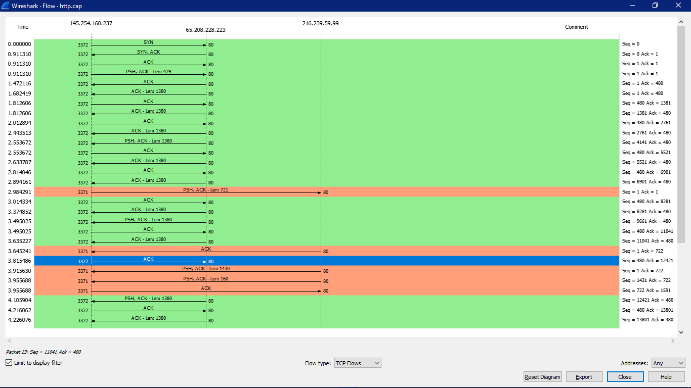
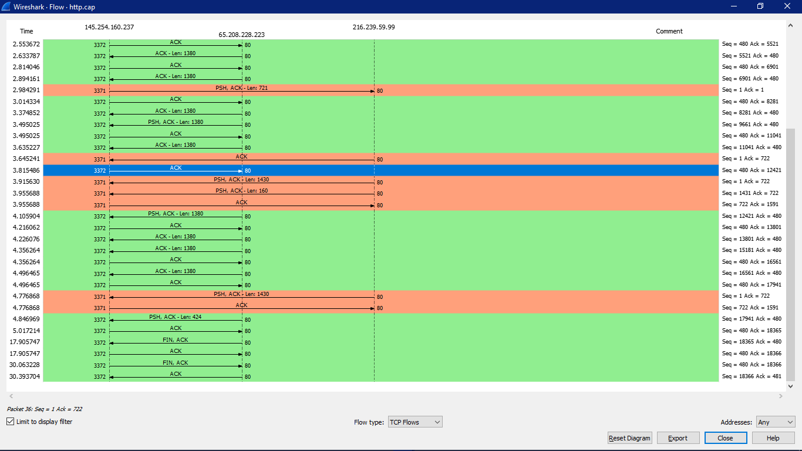

# KONSEP JARINGAN

###### Detik 0 - 1: Permulaan Permintaan HTTP
1. Detik 0: User memasukkan URL situs web di Client dan menekan "Enter".
2. Detik 1: Client User menginisiasi koneksi dengan server tujuan menggunakan protokol TCP/IP. Proses ini melibatkan tiga langkah, yaitu perancangan koneksi, sinkronisasi urutan nomor urut, dan pertukaran informasi tentang ukuran jendela.

Detik 2 - 3: Permintaan HTTP
3. Detik 2: Setelah koneksi terbentuk, Client mengirimkan pesan SYN (synchronize) ke alamat IP server yang sesuai dan port 80 (port default untuk HTTP). Ini merupakan langkah pertama dalam proses TCP handshake.
4. Detik 3: User Client menerima pesan SYN-ACK dari server dan mengirimkan pesan ACK (acknowledge) sebagai tanggapan. Tahap ini menyelesaikan proses TCP handshake dan membuka koneksi TCP yang stabil antara peramban Anda dan server di port 80.

Detik 4 - 8: Proses Server
5. Detik 4: Setelah koneksi terbuka, User Client mengirimkan permintaan HTTP GET ke server untuk alamat URL yang diminta. Permintaan ini mencakup informasi seperti alamat URL lengkap dan header permintaan HTTP.

6. Detik 5: Jika sumber daya adalah halaman statis, server akan mengambil berkas tersebut dari sistem file atau memori cache, dan kemudian mempersiapkannya untuk pengiriman.

7. Detik 6-7: Jika sumber daya adalah halaman dinamis (misalnya, halaman web yang dihasilkan secara dinamis dari database), server akan menjalankan skrip atau program yang diperlukan untuk menghasilkan konten yang sesuai.

8. Detik 8: Server memasukkan konten yang dihasilkan ke dalam pesan respons HTTP, termasuk status kode (misalnya, 200 OK jika berhasil) dan header respons (seperti jenis konten dan panjang konten).

Detik 9 - 12: Pengiriman Respons HTTP
9. Detik 9: Respons HTTP, yang berisi konten yang diminta, dikirimkan kembali ke Client User melalui koneksi TCP yang sama.

10. Detik 10: Client User menerima respons HTTP dan memulai penguraian respons.

11. Detik 11: Jika respons berisi halaman HTML, Client User mulai memproses kode HTML, menampilkan teks, gambar, dan elemen lainnya secara bertahap.

12. Detik 12: Selama proses penguraian, Client User juga akan mengambil sumber daya tambahan yang diperlukan, seperti gambar, CSS, atau JavaScript yang disebutkan dalam kode HTML. Ini mungkin melibatkan permintaan tambahan ke server untuk mengunduh sumber daya ini.

Detik 17 - 30: Menampilkan Halaman Web
13. Detik 17-30: Selama Tahap ini, peramban Anda terus memuat dan menampilkan konten halaman web yang dihasilkan oleh server. Ini mencakup tindakan seperti memuat gambar, CSS, JavaScript, dan sumber daya lain yang diperlukan untuk menampilkan halaman dengan benar. Jika ada permintaan tambahan, mereka akan terjadi melalui koneksi TCP yang sama pada port 80.

---
