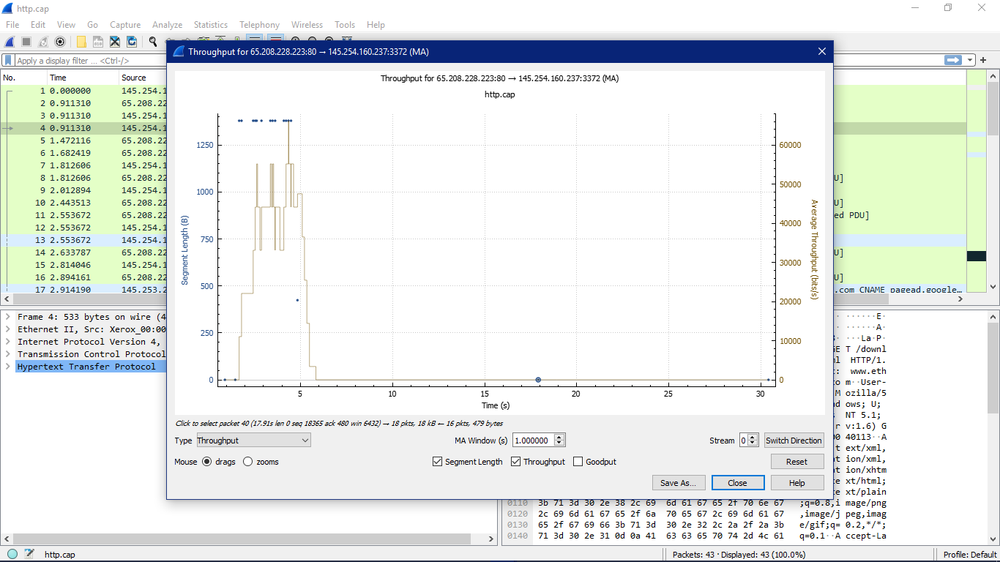

# KONSEP JARINGAN

## Throughput

Throughput merujuk pada jumlah data yang berhasil ditransfer antara dua perangkat dalam sebuah jaringan selama periode waktu tertentu. Ini adalah ukuran yang mengindikasikan seberapa efisien jaringan dalam mengirim data dari satu titik ke titik lain. Throughput diukur dalam unit bits per second (bps) atau kelipatannya seperti Kilobits per second (Kbps), Megabits per second (Mbps), atau Gigabits per second (Gbps), tergantung pada ukuran jaringan yang sedang diamati.

---
