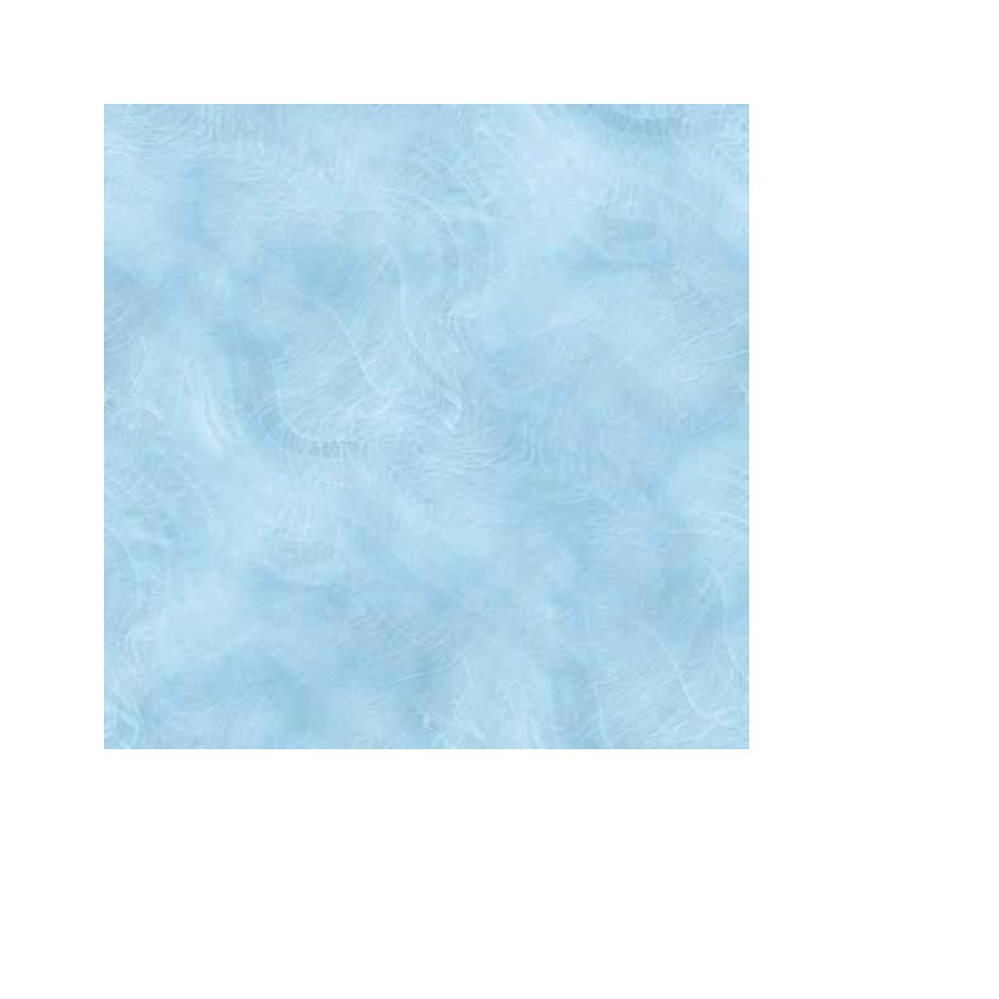
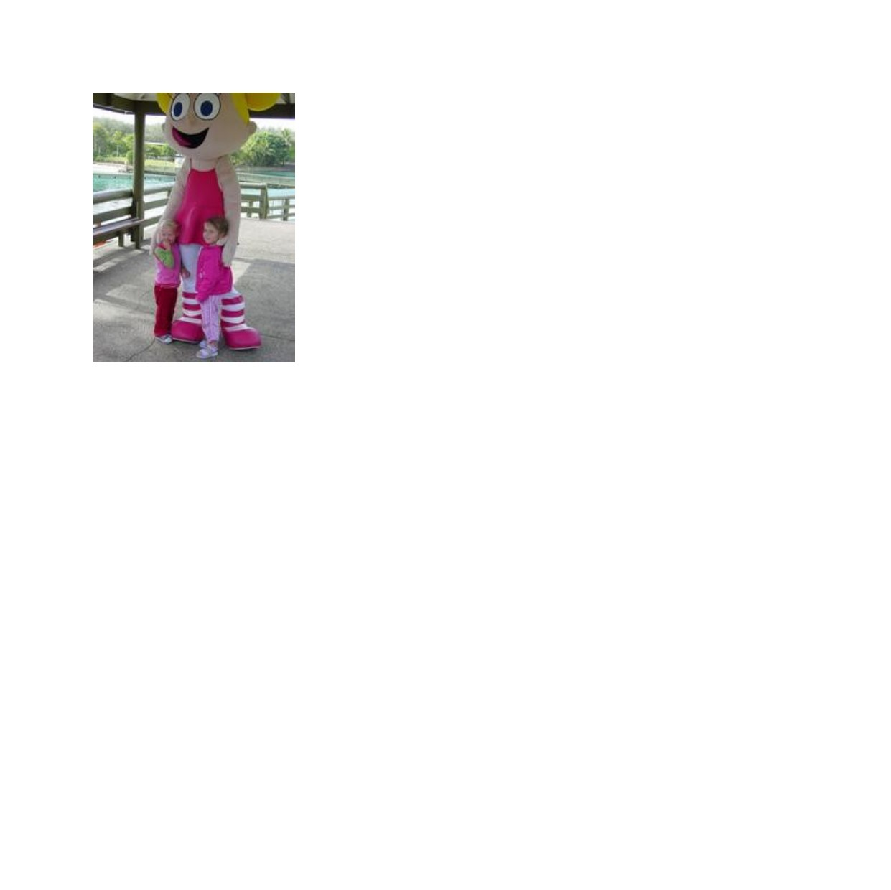

# KONSEP JARINGAN

## http_witp_jpegs.cap
1. Klik bagian info dengan ekstensi JPEG (ada pada line 61, 72, 259, 269, 479)
2. Klik JPEG File Interchange Format, lalu klik bagian Show Packet Bytes atau lebih mudah langsung tekan Ctrl + Shift + O
3. Maka akan ditampilkan sebuah gambar dengan format JPEG.

JPEG File Interchange Format atau bisa disingkat JFIF adalah pemantauan dan analisis aliran data gambar JPEG yang melintasi jaringan. Ini membantu mengidentifikasi masalah, menganalisis kinerja, dan melihat informasi header paket terkait dengan transfer gambar. Wireshark tidak menampilkan gambar asli, tetapi data paket yang berkaitan dengan transfer gambar.

Show Packet Bytes adalah untuk menampilkan representasi heksadesimal dari isi detail setiap byte dalam paket jaringan yang ditangkap. Ini membantu dalam analisis mendalam, pemecahan masalah, dan verifikasi protokol dalam komunikasi jaringan.

Ditemukan 5 file berekstensi JPEG pada http_witp_jpegs.cap, yaitu:

---
1. Line 61

 

2. Line 72

 

3. Line 259

 

4. Line 269

 

5. Line 479

---
