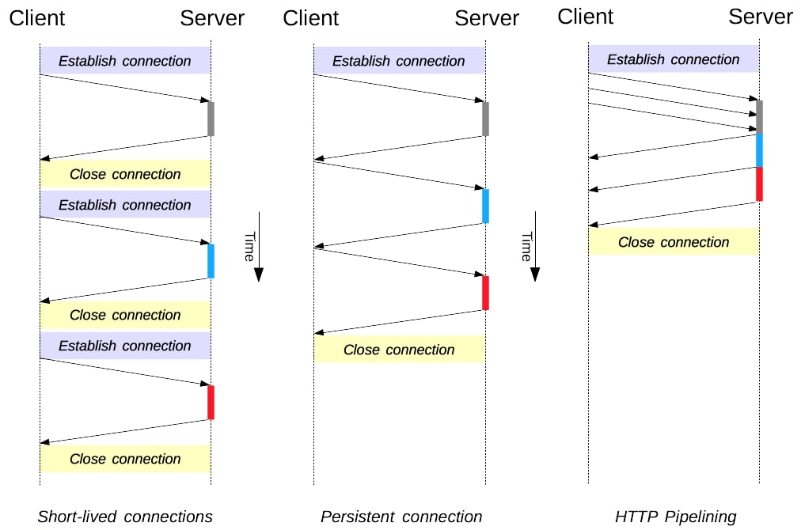

# KONSEP JARINGAN

## HTTP versi0.9 - versi2.0

HTTP (Hypertext Transfer Protocol) adalah protokol yang digunakan untuk mentransfer data di World Wide Web. HTTP pertama kali dikembangkan oleh Tim Berners-Lee pada tahun 1989 dan telah mengalami beberapa evolusi sejak saat itu.

| Versi HTTP | Penjelasan Transformasi | Contoh Penerapan | Perubahan Utama | Keunggulan Utama |
|------------|--------------------------|-------------------|-----------------|------------------|
| HTTP 0.9   | HTTP 0.9 adalah versi awal HTTP yang sangat sederhana. Itu hanya mendukung metode GET. Permintaan HTTP hanya terdiri dari kata kunci "GET", alamat, dan versi protokol. | Contoh Permintaan HTTP 0.9: `GET /index.html` | Tidak ada header HTTP. Tidak ada respons HTTP yang resmi. | Sederhana dan mudah diimplementasikan. Cocok untuk kasus pengambilan dokumen teks statis. |
| HTTP 1.0   | HTTP 1.0 memperkenalkan fitur-fitur seperti header permintaan HTTP, berbagai metode HTTP (GET, POST, dll.), serta dukungan untuk koneksi persisten (Keep-Alive). Header "Host" diperkenalkan, memungkinkan server untuk mendukung beberapa domain pada satu alamat IP. | Contoh Permintaan HTTP 1.0: `GET /index.html HTTP/1.0 Host: www.contoh.com` | Dukungan untuk header HTTP dan berbagai metode. Kemampuan koneksi persisten. | Dapat mengirimkan permintaan HTTP yang lebih kompleks. Mendukung beberapa domain pada satu server. |
| HTTP 1.1   | HTTP 1.1 menghadirkan peningkatan signifikan dalam performa dan efisiensi. Memperkenalkan koneksi persisten secara default, sehingga mengurangi overhead pembukaan/ketutupan koneksi. Pipelining HTTP memungkinkan pengiriman beberapa permintaan tanpa harus menunggu respons sebelumnya. | Contoh Permintaan HTTP 1.1: `GET /index.html HTTP/1.1 Host: www.contoh.com` | Koneksi persisten secara default. HTTP Pipelining. | Kinerja yang lebih baik melalui pengurangan latensi. Pengiriman yang lebih efisien dengan pipelining. |
| HTTP/2.0   | HTTP/2.0 adalah versi terbaru yang menghadirkan transformasi besar. Menggunakan multiplexing untuk mengirim banyak permintaan/respons melalui satu koneksi. Memiliki kompresi header untuk mengurangi beban bandwidth. Prioritisasi permintaan untuk mengoptimalkan pengiriman. | Contoh Permintaan HTTP/2.0: `GET /index.html Host: www.contoh.com` | Multiplexing. Kompresi header. Prioritisasi. | Pengiriman yang lebih cepat melalui multiplexing. Penghematan bandwidth dengan kompresi header. Pengoptimalan pengiriman dengan prioritisasi. |
***
 

  
  
<strong>Gambar:</strong> Perbedaan TCP Session Versi HTTP

TCP Keep-Alive adalah fitur yang ditemukan dalam protokol transport TCP yang digunakan oleh HTTP. Fitur ini memiliki keunggulan besar dibandingkan dengan versi HTTP sebelumnya yang tidak menggunakan koneksi persisten (Keep-Alive). Berikut penjelasan singkatnya:

### Apa itu TCP Keep-Alive?

- **TCP Keep-Alive** adalah mekanisme yang memungkinkan klien dan server untuk menjaga koneksi jaringan terbuka setelah pertukaran awal permintaan dan respons.

### Keunggulan TCP Keep-Alive:

1. **Pengurangan Latensi:** Dengan TCP Keep-Alive, koneksi tetap terbuka setelah respons pertama, mengurangi latensi saat melakukan permintaan berikutnya. Pada HTTP tanpa Keep-Alive, setiap permintaan akan memerlukan pembukaan koneksi baru, yang bisa memakan waktu.

2. **Efisiensi:** Mencegah overhead pembukaan dan penutupan koneksi yang berulang-ulang, sehingga menghemat sumber daya jaringan dan server.

3. **Optimalisasi Kinerja:** Dengan koneksi terbuka, pengguna dapat mengirimkan beberapa permintaan HTTP melalui koneksi yang sama tanpa harus membuka koneksi baru setiap saat. Ini mengoptimalkan kinerja dan pengiriman data.

### Contoh Penggunaan:

- Ketika Anda membuka situs web yang menggunakan TCP Keep-Alive, setelah mengunduh sumber daya awal (seperti HTML), permintaan tambahan seperti gambar, CSS, atau skrip JavaScript dapat dimuat melalui koneksi yang sama tanpa harus membuka koneksi baru untuk setiap elemen. Ini menghasilkan peningkatan signifikan dalam waktu pemuatan halaman.

Dengan demikian, TCP Keep-Alive adalah salah satu fitur yang meningkatkan efisiensi dan kinerja komunikasi web, menghadirkan pengalaman pengguna yang lebih responsif dan cepat.
