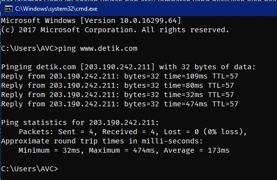

# PING & TRACERT

## 1. Tracer Route (Tracert)
### 1.1 Penjelasan Tracert
Tracert adalah alat untuk melihat rute atau jalan yang digunakan oleh data ketika dikirim melalui internet. Saat Anda mengunjungi sebuah situs web, data Anda melewati beberapa perangkat jaringan. Tracert membantu Anda melihat daftar perangkat ini dan berapa lama data Anda sampai ke masing-masing perangkat. Ini membantu mengidentifikasi masalah jika ada koneksi lambat atau masalah lain dengan situs web atau layanan online yang Anda gunakan. Jadi, Tracert adalah alat untuk memahami perjalanan data Anda melalui internet.

### 1.2 Analisis Tiap Kolom Tracert
* **Hop (Lompatan):** Ini adalah nomor lompatan atau hop dalam perjalanan paket data dari komputer Anda ke tujuan (detik.com). Setiap lompatan mewakili perangkat jaringan atau router yang dilewati oleh paket data saat mencapai tujuan.

* **Waktu (Latency):** Ini adalah waktu yang diperlukan untuk paket data mencapai setiap hop dalam milidetik (ms). Waktu ini mencakup total waktu yang diperlukan untuk mengirim paket ke hop tersebut dan menerima responsnya. Waktu yang lebih rendah biasanya lebih baik, karena menunjukkan koneksi yang lebih cepat.

* **IP Address (Alamat IP):** Ini adalah alamat IP dari setiap hop atau perangkat jaringan yang dilewati. Ini adalah alamat IP dari router atau server di masing-masing lompatan. Anda dapat melihat alamat IP ini untuk melacak perangkat yang dilewati oleh paket.

## 2. Percobaan Ping & Tracert
### 2.1 Ping www.detik.com

**Gambar:** Pinging www.detik.com

* Mengirim 4 paket ping ke situs web www.detik.com, yang diidentifikasi dengan alamat IP 203.190.242.211.

* Hasil ping menunjukkan bahwa 4 dari 4 paket ping yang dikirimkan diterima kembali tanpa kehilangan (0% loss).

* Waktu tempuh (round trip time) paket ping berkisar dari 32ms hingga 474ms.

* Waktu minimum adalah 32ms, waktu maksimum adalah 474ms, dan rata-rata waktu adalah sekitar 173ms.

* TTL (Time to Live) adalah 57, yang merupakan jumlah langkah yang dapat dilakukan oleh paket sebelum dihapus dari jaringan.

Hasil ini menunjukkan bahwa koneksi ke www.detik.com responsif, tetapi waktu respons bervariasi, mungkin karena lalu lintas jaringan atau faktor lainnya. Tidak ada paket yang hilang selama pengujian, yang merupakan hal yang baik.

### 2.2 Tracert www.detik.com

**Gambar:** Tracert www.detik.com

Dalam analisis tracert ini, paket data telah melewati 6 hop sebelum mencapai tujuan di server www.detik.com. Di bawah adalah analisis singkat setiap hop:

* **Hop 1:** Paket data pertama kali mencapai gateway atau router di jaringan lokal Anda (192.168.18.1).

* **Hop 2:** Kemudian, paket data bergerak melalui jaringan ISP Anda (10.235.0.1).

* **Hop 3:** Selanjutnya, paket data pergi ke alamat IP yang diakses oleh ISP (117.102.79.181).

* **Hop 4:** Di hop ini, Anda mungkin melihat beberapa waktu latency dan kegagalan paket. Ini bisa disebabkan oleh masalah di router atau server di sana (218.100.36.2).

* **Hop 5:** Paket data kemudian bergerak lebih jauh dalam jaringan ISP (218.100.36.9).

* **Hop 6:** Terakhir, paket data mencapai server www.detik.com dengan alamat IP 203.190.242.211.

