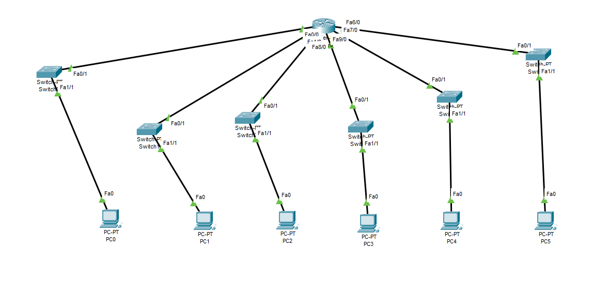

# OFFICE FACILITY

### OFFICE FACILITY DENGAN PUBLIC IP : 12.0.0.0/8 & 6 SUBNET 

**Gambar:** Konfigurasi Jaringan

Pada percobaan konfigurasi jaringan fasilitas kantor dengan Packet Tracer yang pertama, digunakan 1 router, 6s switch dan 6 PC.
Berikut adalah konfigurasi dari peragkat yang digunakan :

1. Menggunakan Router-PT, dimana terdapat  konfigurasi :
   - FastEthernet(Fa) 0/0 : 12.32.0.1
   - FastEthernet(Fa) 1/0 : 12.64.0.1
   - FastEthernet(Fa) 6/0 : 12.96.0.1
   - FastEthernet(Fa) 7/0 : 12.128.0.1
   - FastEthernet(Fa) 0/0 : 12.160.0.1
   - FastEthernet(Fa) 0/0 : 12.192.0.1

2. Lakukan konfigurasi pada keempat PC dengan IP Address sebagai berikut :

   - PC0 => 12.33.0.2
   - PC1 => 12.65.0.2
   - PC2 => 12.97.0.2
   - PC3 => 12.129.0.2
   - PC3 => 12.161.0.2
   - PC3 => 12.193.0.2

3. Hubungkan seluruh komponen jaringan yang ada dengan menggunakan kabel tipe straight seperti yang terlihat pada gambar di atas. Jangan lupa meng-onkan seluruh jaringan hingga ada tanda segitiga warna hijau. Pastikan subnet mask diganti dengan 255.224.0.0

**Melakukuan Ping Test**
Setelah selesai melakukan konfigurasi, selanjutnya adalah melakukan Ping test.

**1. Ping 12.33.0.2 -> 12.65.0.2**

**Gambar:** Ping 1

Ketika perintah ping pertama kali dijalankan, maka akan terjadi broadcast dimana jika menggunakan switch broadcast hanya akan dijalankan sekali di awal ketika ingin menghubungkan suatu perangkat yang mana berfungsi untuk mencari dimana ip address yang dituju, setelah mendapatkan address yang dituju perangkat pengirim ping akan mendapatkan konfirmasi dan selanjutnya akan mengirim sebanyak 4 packets ke address yang dituju.

**2. Ping 12.65.0.2 -> 12.97.0.2**

**Gambar:** Ping 2

**3. Ping 12.97.0.2 -> 12.129.0.2**

**Gambar:** Ping 3

**4. Ping 12.129.0.2 -> 12.161.0.2**

**Gambar:** Ping 4

**5. Ping 12.161.0.2 -> 12.193.0.2 (PT-Hub)**

**Gambar:** Ping 5

***
